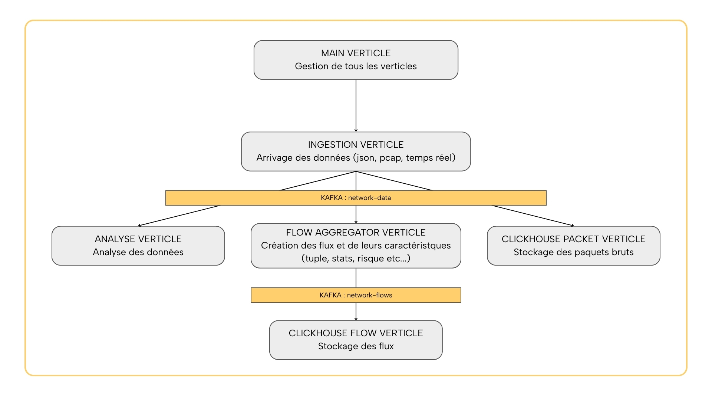

# Network Traffic Analyzer

[](https://www.java.com/)
[](https://maven.apache.org/)
[](https://www.docker.com/)

## Auteur

Tom MULLIER

## Description

Le projet **Network Traffic Analyzer** est une application Java basée sur **Vert.x** permettant la collecte, le traitement et l’analyse en temps réel du trafic réseau.
Il s’appuie sur **Kafka** pour la gestion des flux de données et **ClickHouse** pour le stockage et l’analyse performante des données réseau.

Le projet est conçu pour fonctionner sur **Linux** et utilise Docker pour orchestrer ses composants. Il inclut un script d’installation multi-distribution qui facilite le déploiement sur différentes distributions Linux.

---

## Architecture

L’application est organisée autour de trois composants principaux :

1. **Zookeeper**

   * Coordonne les brokers Kafka et assure la haute disponibilité des topics.

2. **Kafka**

   * Permet la collecte des données réseau et leur distribution sous forme de topics :

     * `network-data` : données brutes des paquets réseau
     * `network-flows` : données agrégées sur les flux réseau

3. **ClickHouse**

   * Base de données analytique pour stocker et interroger les données collectées avec haute performance.

4. **Application Java Vert.x**

   * Consomme les topics Kafka et traite les données pour les stocker dans ClickHouse ou les analyser en temps réel.

---

## Diagramme des flux

Vous trouverez ci-dessous un diagramme illustrant les flux de données entre les différents composants de l’application.



---

## Prérequis

* Linux (Ubuntu, Debian, Fedora, CentOS, RHEL, Arch, openSUSE)
* Docker et Docker Compose
* Java 11 ou supérieur
* Maven

---

## Installation

1. **Cloner le dépôt :**

```bash
git clone https://github.com/TomMullier/AUT25-VertX-NetworkAnalysis.git
cd AUT25-VertX-NetworkAnalysis
```
ou avec SSH :
```bash
git clone git@github.com:TomMullier/AUT25-VertX-NetworkAnalysis.git
cd AUT25-VertX-NetworkAnalysis
```

2. **Exécuter le script d’installation :**
   Le script installe Java, Maven, Docker et Docker Compose, démarre les conteneurs nécessaires et initialise la base ClickHouse ainsi que les topics Kafka.

```bash
chmod +x start.sh
./start.sh
```

> Le script détecte automatiquement la distribution Linux et adapte l’installation en conséquence.

---

## Conteneurs Docker utilisés

| Conteneur  | Rôle                               |
| ---------- | ---------------------------------- |
| Zookeeper  | Coordination des brokers Kafka     |
| Kafka      | Gestion des flux de données réseau |
| ClickHouse | Stockage et analyse des données    |

---

## Kafka Topics

* `network-data` : données brutes réseau
* `network-flows` : données agrégées sur les flux

> Les topics sont réinitialisés automatiquement par le script d’installation.

---

## Base de données ClickHouse

Le script initialise :

* La base de données
* Les utilisateurs
* Les tables nécessaires à l’application

Fichier d’initiation : `src/main/resources/clickhouse-init/init.sql`

---

## Compilation et lancement

Après l’installation, l’application est compilée et lancée automatiquement :

```bash
mvn compile vertx:run
```

---

## Nettoyage des conteneurs Docker

Pour arrêter et supprimer les conteneurs utilisés par l’application :

```bash
sudo docker stop zookeeper kafka clickhouse
sudo docker rm zookeeper kafka clickhouse
```

---

## Notes

* Le script d’installation est conçu pour être multi-distribution.
* Il est recommandé d’exécuter le script avec des droits `sudo`.
* Les logs des services peuvent être consultés avec :

```bash
docker logs kafka
docker logs clickhouse
```
