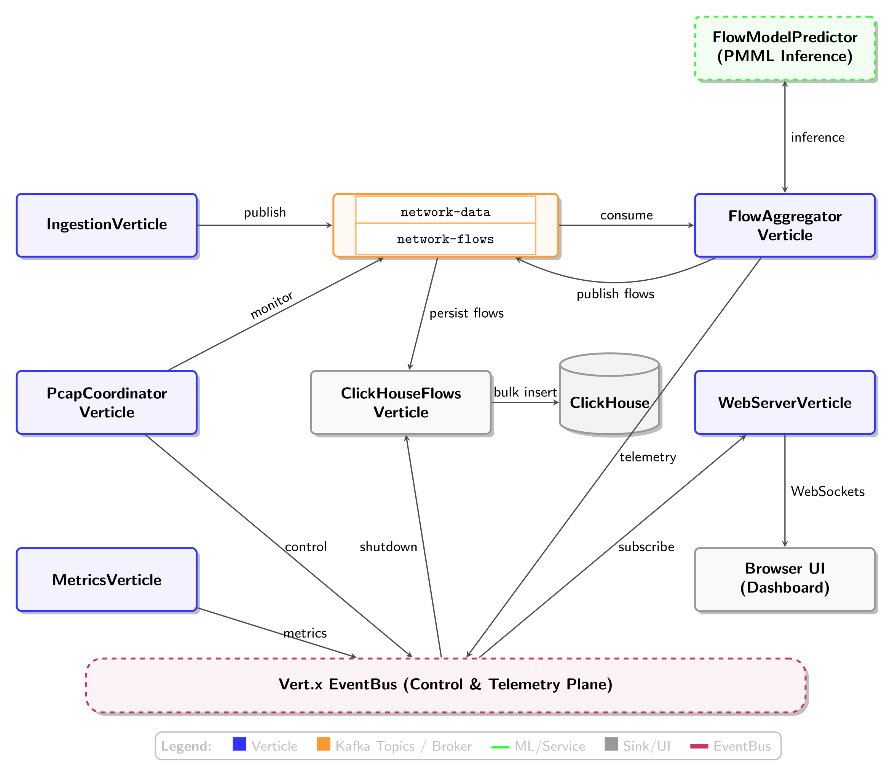
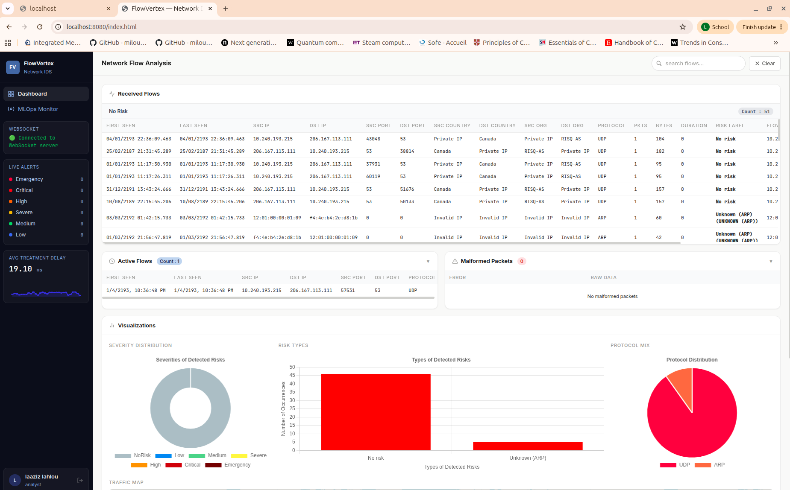
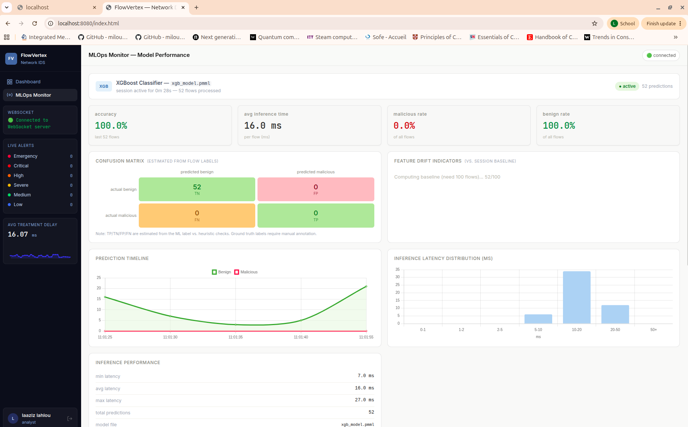

---
title: 'FlowVertex: a Java-based vert.x network data analysis framework using Artificial Intelligence for cybersecurity research'
tags:
  - Java
  - network
  - cybersecurity
  - intrusion detection
  - anomaly detection
  - machine learning
  - artificial intelligence
authors:
  - name: Laaziz Lahlou
    corresponding: true
    equal-contrib: true
    affiliation: 1
  - name: Tom Mullier
    equal-contrib: true
    affiliation: 1
  - name: Abdelillah Serghine
    affiliation: 3
  - name: Nadjia Kara
    affiliation: 1
  - name: Farid Nait-Abdesselam
    affiliation: 2
  - name: Sidi Mohammed Benslimane
    affiliation: 3
affiliations:
 - name: Ecole de Technologie Superieure, Montreal, Quebec, Canada
   index: 1
 - name: Université Paris Cité, France
   index: 2
 - name: École supérieure en informatique 08 Mai 1945 - Sidi Bel Abbès -, Algeria
   index: 3
date: 20 April 2026
bibliography: paper.bib

# Summary

FlowVertex is an end-to-end network telemetry and cybersecurity research platform built on the Eclipse Vert.x reactive toolkit. It bridges the gap between raw packet capture and actionable security intelligence by providing a unified pipeline for High-Throughput Ingestion, Stateful Flow Aggregation, and Columnar Analytical Storage. Designed for reproducibility, FlowVertex processes both offline PCAP traces and live network traffic through identical processing logic, ensuring that research prototypes can be deployed directly into operational environments. The framework features built-in Machine Learning (ML) inference (via Predictive Model Markup Language (PMML)), real-time enrichment services (GeoIP, DNS), and an interactive web-based monitoring dashboard, offering a lightweight yet scalable alternative to fragmented telemetry stacks.

# Statement of need

Modern network telemetry workflows increasingly rely on flow-level representations rather than raw packets alone, especially when downstream tasks include anomaly detection, operational monitoring, or ML-based classification. However, in practice, the tooling landscape is fragmented. Some tools emphasize packet capture and protocol logging, some focus on flow feature extraction for offline analysis, and others provide large-scale storage or signature-based threat detection. For users who need an end-to-end pipeline that combines packet ingestion, flow reconstruction, real-time streaming, storage, dashboarding, and ML inference in a single open-source system, the integration effort remains substantial.

This project addresses this gap by providing a modular network traffic analysis platform built around Vert.x, Kafka, and ClickHouse. The software supports both offline PCAP replay and live interface capture, reconstructs packets into flows, computes flow statistics, optionally enriches them with contextual metadata, persists packets and flows for analytical querying, and exposes live results through a web dashboard and WebSocket interface. It also supports flow-level ML inference using a pretrained model, allowing the same pipeline to be used for both exploratory monitoring and online detection.

The intended users are students, researchers, and practitioners working on network security monitoring, traffic characterization, and ML-driven NIDS who need a reproducible, extensible, and stream-oriented platform rather than a standalone feature extractor or a monolithic NIDS. By combining ingestion, aggregation, storage, visualization, and inference in one codebase, the software lowers the implementation burden for experimental workflows and makes it easier to move between offline datasets and live traffic analysis.

The second motivation is architectural. Existing research prototypes often stop at CSV export or model evaluation, while production tools may be powerful but less convenient for rapid experimentation with custom flow features, custom data sinks, or embedded ML components. This project is therefore useful as both a research platform and a system prototype to evaluate end-to-end traffic analysis pipelines under streaming conditions.

# State of the field

Several established open-source systems address parts of this problem space, but they target different operational and research needs.

Zeek is a mature open-source network traffic analyzer widely used for network security monitoring. Its strength lies in rich protocol-aware logging, semantic network visibility, and extensibility through its scripting framework rather than in providing a built-in streaming feature-extraction and ML pipeline [@zeek]. Similarly, Suricata is a high-performance IDS/IPS and network security monitoring engine designed primarily around threat detection, rules, and packet inspection, with strong real-time operational capabilities but a different emphasis from flow-centric analytics pipelines [@suricata].

At the packet-retention end of the spectrum, Arkime provides large-scale packet capture, indexing, and search over PCAP data, with a web interface and scalable storage-oriented design [@arkime]. Arkime is particularly well suited when full-packet retention and retrospective search are primary requirements. By contrast, the present project is centered on streaming flow construction, feature computation, and online downstream processing.

For flow-oriented research, NFStream is one of the closest related tools. NFStream is a flexible framework for online and offline network flow analysis, with statistical feature extraction and support for reproducible network-data analytics workflows [@nfstream1; @nfstream2]. Its design is especially strong for Python-based research pipelines and flow analytics. The software presented here differs in scope by combining flow processing with a Kafka-based event pipeline, ClickHouse persistence, a browser dashboard, and embedded ML inference inside a single reactive Java application.

RustiFlow is also closely related. Verkerken et al. present RustiFlow as an open-source, eBPF-based network flow extractor developed in Rust and explicitly position it as a bridge between security research prototypes and operational deployments [@rustiflow]. Its emphasis on high-throughput, modular feature extraction and real-time monitoring makes it particularly relevant to systems that aim to support both experimental and production-oriented workflows. Compared with RustiFlow, the present project places more emphasis on end-to-end pipeline integration, including Kafka-based streaming, ClickHouse-backed persistence, web-based visualization, and built-in flow-level ML inference.

CICFlowMeter is another important point of comparison. It is widely used to generate bidirectional flow features from PCAP traces and has been used in several public intrusion-detection datasets [@cicflowmeter1; @cicflowmeter2]. Its main contribution is standardized feature extraction for offline or capture-driven workflows. Relative to CICFlowMeter, the present project aims to provide a broader streaming platform: beyond feature generation, it includes message-bus decoupling, storage, visualization, and real-time inference.

Taken together, these systems show that the individual building blocks of network traffic analysis are well represented in open source, but they are often distributed across separate tools: protocol logging in Zeek, threat detection in Suricata, packet retention in Arkime, flow analytics in NFStream and RustiFlow, and feature extraction in CICFlowMeter. The contribution of this project is to integrate these concerns into a single, developer-extensible platform for packet-to-flow processing, streaming analytics, persistent storage, visualization, and ML-assisted detection.

# Software design

This section discusses the software design philosophy and the approach adopted in the development of FlowVertex.

## Architectural Trade-offs and Design Decisions

FlowVertex is designed as a streaming network-analysis platform for research use cases that must support both offline packet capture replay and live traffic inspection within a single analytical framework. The software adopts a decomposed architecture based on Vert.x verticles and Kafka topics rather than a monolithic packet-processing loop. 

In this design, packet ingestion, flow aggregation, persistence, metrics collection, and web delivery are implemented as separate components connected through explicit message boundaries. This choice increases deployment complexity, because it introduces coordination across Kafka, ClickHouse, and multiple workers, but it provides two research advantages: each stage can be benchmarked or modified independently, and the same captured traffic can be replayed through unchanged downstream logic. That separation is important for reproducible experimental workflows.

To ensure FlowVertex meets the demanding requirements of modern cybersecurity research, several critical design trade-offs were weighed:

1. **Java and Vert.x vs. Native C/C++ or Python**:
   While tools written in C/C++ (like YAF) offer maximum raw packet processing speed, they are notoriously difficult to extend with modern Machine Learning workflows. Conversely, Python is the lingua franca for ML but struggles with high-throughput concurrent processing due to the Global Interpreter Lock (GIL). We chose a Java-based non-blocking event loop architecture (Vert.x) utilizing the *Actor Model*. This bridges the gap, enabling packet ingestion while allowing seamless integration of pre-trained ML pipelines (via PMML) for real-time inference without the overhead of cross-language Inter-Process Communication (IPC). 

2. **Staged Event-Driven Architecture (SEDA) vs. Monolithic In-Memory Processing**: Directly passing data between objects in memory offers the lowest possible latency. However, network traffic in research scenarios (such as analyzing DDoS attacks) is highly bursty and can easily overwhelm an in-memory pipeline. We adopted a decoupled SEDA pipeline using *Kafka* as an asynchronous buffer between the distinct processing stages (Ingestion $\rightarrow$ Aggregation $\rightarrow$ Storage). While this introduces slight serialization latency, it provides vital fault tolerance and allows researchers to horizontally scale the most CPU-intensive aggregation stages independently.

3. **Columnar Storage (ClickHouse) vs. Traditional Relational or Document Databases**: Traditional relational database management systems (like PostgreSQL) are optimized for transactional row-level updates, while Document stores (like Elasticsearch) provide flexible search but suffer from significant storage bloat and slow aggregation times at scale. Because network flow analysis rarely requires updating historical records and relies entirely on heavy time-series aggregations, we chose ClickHouse. Paired with a Batching Pattern for JDBC bulk inserts, this columnar database maximizes write throughput and allows researchers to execute complex analytical queries over billions of flow records in milliseconds.

4. **Model Portability vs. Native Inference**: Integrating Machine Learning models into high-performance streaming pipelines often requires either rebuilding the model in the target language or relying on fragile and high-latency Inter-Process Communication (IPC). To solve this, we chose the **JPMML-Evaluator** ecosystem. By utilizing **Predictive Model Markup Language (PMML)** as a canonical interchange format, FlowVertex can deploy models trained in Python or R directly into the JVM. This design allows researchers to iterate on model training using their preferred data-science stacks while maintaining a unified, low-latency Java pipeline for production-like deployment.

## Verticle-Oriented Architecture

FlowVertex follows an event-driven Vert.x architecture where each *verticle* encapsulates one stage of the network-analysis pipeline. The design separates orchestration, ingestion, flow computation, persistence, API exposure, and observability.

FlowVertex encompasses a set of primary functional modules (verticles and Services) described hereinafter.

- **Main (Orchestrator):** Bootstraps the application, loads the configuration, manages the deployment lifecycle of all Verticles, and provides an interactive Command Line Interface (CLI) for selecting the ingestion mode (`pcap`, `pcap-instant`, or `realtime`).
- **IngestionVerticle (Data Producer):** Captures raw network traffic from PCAP files or a live network interface and publishes base64-encoded packets to the *network-data* Kafka topic.
- **FlowAggregatorVerticle (Data Processor):** Consumes raw packets from Kafka, aggregates them into network flows using 5-tuple keys, enriches them with threat intelligence, and publishes the summarized flow records to the network-flows Kafka topic.
- **FlowModelPredictor (ML Inference Engine):** Provides real-time classification of network flows by evaluating extracted features against pre-trained models. It utilizes the **JPMML-Evaluator** library to interpret **PMML** files, allowing models trained in Python (e.g., via Scikit-learn or XGBoost) to be executed within the JVM without cross-language overhead. This component supports a wide range of algorithms, including Gradient Boosted Trees and Random Forests, and appends classification results directly to the flow metadata before persistence.
- **ClickHouseFlowsVerticle & ClickHousePacketVerticle (Data Sinks):** Batch-consumes flow and packet records from Kafka topics and persists them into a ClickHouse database for high-performance analytical querying.
- **PcapCoordinatorVerticle (Synchronization):** Monitors the processing progress across distributed Kafka partitions and signals completion (*PCAP_DONE*) globally to orchestrate orderly shutdown and metric collection.
- **WebServerVerticle & api/routes/* (API & UI):** Exposes REST APIs for dynamic configuration management and hosts a WebSocket server to broadcast real-time flows, packets, and system metrics to frontend clients.
- **MetricsVerticle & SystemMetricsVerticle (Telemetry):** Gathers internal processing rates and host system metrics (CPU/RAM utilization) and pushes them to the Vert.x EventBus.
- **services/* (Enrichment Services):** Provides external data context like IP geolocation (GeoIPService), DNS resolution (DnsService), and Whois information (WhoisService).

## System Overview

The system is driven by the Vert.x non-blocking Event Loop as its core engine, orchestrating highly concurrent Verticles that communicate asynchronously.

- **Data Pipeline Flow:**
  1. The *IngestionVerticle* acts as the source, reading packets and writing them at high throughput into the network-data Kafka topic.
  2. A pool of *FlowAggregatorVerticle* instances consumes *network-data*, maintains stateful flow tracking in memory, applies enrichment/ML inference, and flushes completed or expired flows to the downstream network-flows Kafka topic.
  3. The *ClickHouseFlowsVerticle* consumes *network-flows*, buffering records in memory, and performs bulk inserts into ClickHouse for persistent storage.

- **Control Flow:** The *Main* Verticle orchestrates the initialization phase. During PCAP ingestion, the PcapCoordinatorVerticle tracks Kafka partitions. When the file EOF is reached, a *PCAP_DONE* control message propagates through Kafka to signal downstream aggregators to safely flush their remaining in-memory flows.

- **Real-Time Visualization Flow:** While data flows through the main pipeline, the aggregators and metric verticles simultaneously publish snapshot events (e.g., currentFlows.data, metrics.core) to the Vert.x EventBus. The WebServerVerticle listens to these internal EventBus channels and bridges them to the frontend UI by broadcasting the updates over WebSockets. Conversely, user actions in the UI (like changing settings) hit REST endpoints defined in api/routes, which interact with the Main Verticle to redeploy components if necessary.

The diagram in \autoref{fig:verticle_interaction} visualizes the primary data processing pipeline from raw packet ingestion to ClickHouse persistence.

# User Interface

An overview of the web interface of FlowVertex is shown in \autoref{fig:main_web_page}. As can be seen, in this figure, a dashboard displays details related to flows created in real-time by listening to a physical network interface card (e.g., received flows, risk alerts, active flows, malformed packets, etc.). Another figure as displayed in \autoref{fig:mlops_page} provides details related to the Machine Learning Operations (MLOps) monitoring dashboard with an XGBoost classifier model up and running.

# Research impact statement

FlowVertex fills a gap in open network-analysis software by combining traffic ingestion, flow reconstruction, enrichment, benchmarking, and interactive visualization in a single reproducible framework. Existing tools such as packet analyzers, flow generators, or monitoring stacks are often strong in one part of this workflow, but they usually cause laborious efforts in that they require researchers to assemble separate pipelines for offline PCAP evaluation and live deployment.

FlowVertex reduces that fragmentation by processing both replayed and live traffic through the same Vert.x and Kafka pipeline, producing enriched flow records that can be stored, visualized, and compared against reference tools. This is particularly valuable for research in network measurement, flow-based intrusion detection, and traffic feature engineering, where reproducibility and comparability are as important as throughput.

The broader impact of the software lies in enabling experiments and operational observation to share the same implementation path, thereby reducing the integration overhead and making published analyzes easier to reproduce and extend.

Although FlowVertex began as a capstone project, its long-term vision has always been to become a collaborative research platform for graduate students. Today the aim is to provide a flexible and extensible environment to design, implement and experimentally evaluate AI-driven cybersecurity solutions, while fostering reproducible research and collaboration among students and researchers.

# Extensibility and Sustainability

FlowVertex is designed for long-term research utility through a highly modular architecture [@TomMullier2026; @Abdelillah2026]. Researchers can extend the framework in three primary ways: (1) by adding new `service` modules for custom data enrichment (e.g., threat intelligence feeds), (2) by deploying new `FlowModelPredictor` PMML files for novel detection tasks without recompiling the core engine, and (3) by implementing custom Vert.x sinks to export data to alternative storage backends or external SIEM platforms. 

To ensure sustainability and ease of maintenance, the project utilizes standard Maven-based dependency management and follows a strict decoupled design that allows individual components (e.g., the Kafka broker or ClickHouse database) to be updated or replaced independently. We actively encourage community contributions via our GitHub repository [@github_repo_flow_vertex] to expand the library of supported flow features, protocol decoders, and real-time analytical dashboards.

# AI usage disclosure

During the preparation of this work, the authors used AI assistants (e.g., large language models) for editing, translating, formatting, and refining the text and code structure. After using this tool/service, the authors reviewed and edited the content as needed and take full responsibility for the content of the publication.

# Acknowledgements

# References
